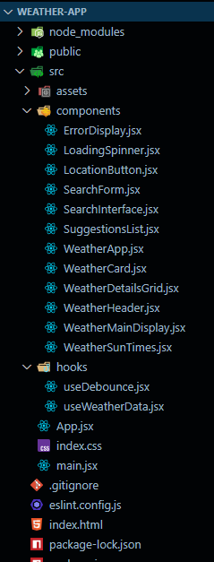

# Weather App 🌤️

A modern, responsive weather application built with React and Vite that provides real-time weather information with intelligent city search suggestions and location-based weather data.

## ✨ Features

- **Smart City Search**: Real-time city name suggestions with autocomplete functionality
- **Current Location Weather**: Automatic weather detection based on your geographical location
- **Comprehensive Weather Data**: Detailed weather information including temperature, humidity, wind speed, and forecast
- **Weather Interface Components**: Modular components for different weather data displays
- **Error Handling**: Robust error display and user feedback system
- **Loading States**: Smooth loading animations and spinners for better UX
- **Responsive Design**: Fully responsive interface optimized for all screen sizes

## 🚀 Technologies Used

- **React 18** - Modern React with hooks and functional components
- **Vite** - Lightning-fast build tool and development server
- **Tailwind CSS** - Utility-first CSS framework for responsive styling
- **JavaScript ES6+** - Modern JavaScript features and async/await
- **Weather API** - Real-time weather data integration
- **Geolocation API** - Browser's built-in location services
- **Custom Hooks** - Reusable logic with custom React hooks

## 🛠️ Installation

1. Clone the repository:

   ```bash
   git clone https://github.com/dev-abhishekanand/react-machine-coding.git
   cd weather-app
   ```

2. Install dependencies:

   ```bash
   npm install
   ```

3. Create a `.env` file in the root directory and add your weather API key:

   ```env
   VITE_WEATHER_API_KEY=your_api_key_here
   ```

4. Start the development server:

   ```bash
   npm run dev
   ```

5. Open your browser and navigate to `http://localhost:5173`

## 🎯 Usage

### Search for Weather by City

1. Use the search form to enter a city name
2. Select from intelligent city suggestions that appear as you type
3. View comprehensive weather details including current conditions and forecasts

### Get Current Location Weather

1. Click the location button to get weather for your current position
2. Allow location access when prompted by your browser
3. View detailed weather information for your exact location

## 🏗️ Project Structure

```
weather-app/
├── public/
├── src/
│   ├── assets/                 # Static assets and images
│   ├── components/
│   │   ├── ErrorDisplay.jsx    # Error handling component
│   │   ├── LoadingSpinner.jsx  # Loading state component
│   │   ├── LocationButton.jsx  # Current location button
│   │   ├── SearchForm.jsx      # City search form
│   │   ├── SearchInterface.jsx # Search interface wrapper
│   │   ├── SuggestionsList.jsx # City suggestions dropdown
│   │   ├── WeatherApp.jsx      # Main weather app component
│   │   ├── WeatherCard.jsx     # Weather display card
│   │   ├── WeatherDetailsGrid.jsx # Detailed weather grid
│   │   ├── WeatherHeader.jsx   # Weather header component
│   │   ├── WeatherMainDisplay.jsx # Main weather display
│   │   └── WeatherTimes.jsx    # Weather timing information
│   ├── hooks/
│   │   ├── useDebounce.jsx     # Debouncing custom hook
│   │   └── useWeatherData.jsx  # Weather data management hook
│   ├── App.jsx                 # Root application component
│   ├── index.css              # Global styles and Tailwind imports
│   └── main.jsx               # Application entry point
├── .gitignore
├── eslint.config.js           # ESLint configuration
├── index.html                 # HTML template
├── package-lock.json
├── package.json               # Dependencies and scripts
└── README.md
```

## 🔧 React Concepts Implemented

### Core React Features

- **Functional Components**: All components built with modern functional syntax
- **JSX**: Extensive use of JSX for component rendering
- **Props**: Efficient data passing between parent and child components
- **State Management**: Local state management with useState hook

### Advanced React Hooks

- **useState**: Managing component state for weather data, search terms, and UI states
- **useEffect**: Handling side effects, API calls, and cleanup operations
- **useCallback**: Optimizing function references to prevent unnecessary re-renders
- **useMemo**: Memoizing expensive calculations and filtered data
- **Custom Hooks**:
  - `useDebounce` for optimizing search input performance
  - `useWeatherData` for centralized weather data management

### Component Architecture

- **Component Composition**: Breaking down the UI into reusable, focused components
- **Conditional Rendering**: Dynamic UI based on loading states, errors, and data availability
- **Event Handling**: Comprehensive event management for user interactions
- **Error Boundaries**: Graceful error handling with dedicated error display components

### Performance Optimizations

- **Debounced Search**: Preventing excessive API calls during user typing
- **Lazy Loading**: Optimized component loading strategies
- **Memoization**: Preventing unnecessary component re-renders
- **Efficient State Updates**: Batched state updates for better performance

## 🌐 API Integration

The application integrates with weather services to provide:

- **Real-time Weather Data**: Current weather conditions and forecasts
- **City Search API**: Intelligent city name suggestions and autocomplete
- **Geolocation Services**: Location-based weather information
- **Error Handling**: Robust API error management and user feedback

## 📱 Responsive Design Features

Built with mobile-first approach using Tailwind CSS:

- **Flexible Grid Layouts**: Responsive weather data display grids
- **Mobile-Optimized Components**: Touch-friendly interface elements
- **Adaptive Typography**: Scalable text and icon sizing
- **Cross-Device Compatibility**: Consistent experience across all devices

## 🎨 Component Details

### Weather Display Components

- **WeatherApp**: Main application wrapper and state management
- **WeatherCard**: Primary weather information display
- **WeatherHeader**: App branding and navigation
- **WeatherMainDisplay**: Central weather data presentation
- **WeatherDetailsGrid**: Detailed weather metrics in grid layout
- **WeatherTimes**: Sunrise, sunset, and timing information

### Search Components

- **SearchForm**: Main search input and form handling
- **SearchInterface**: Search functionality wrapper
- **SuggestionsList**: Dynamic city suggestions dropdown
- **LocationButton**: Current location weather detection

### Utility Components

- **LoadingSpinner**: Loading state animations
- **ErrorDisplay**: Error messaging and user feedback

## 🔮 Future Enhancements

- [ ] Weather maps and radar integration
- [ ] Extended forecast (7-day, hourly)
- [ ] Weather alerts and severe weather notifications
- [ ] Favorite locations and quick access
- [ ] Weather data visualization charts
- [ ] Dark/Light theme toggle
- [ ] PWA capabilities for offline usage
- [ ] Weather history and trends

## 🚀 Performance Features

- **Debounced Search**: Optimized API calls with custom debounce hook
- **Efficient State Management**: Centralized weather data handling
- **Component Optimization**: Memoized components and calculations
- **Fast Build Times**: Vite's optimized development and build process

## 🤝 Contributing

1. Fork the project
2. Create your feature branch (`git checkout -b feature/AmazingFeature`)
3. Commit your changes (`git commit -m 'Add some AmazingFeature'`)
4. Push to the branch (`git push origin feature/AmazingFeature`)
5. Open a Pull Request

## 📄 License

This project is licensed under the MIT License - see the [LICENSE](LICENSE) file for details.

## 🙏 Acknowledgments

- Weather data provided by weather API services
- React community for excellent documentation and resources
- Tailwind CSS for the utility-first CSS framework
- Vite team for the amazing build tool

## 📞 Contact

Your Name - @dev-abhishekanand

Project Link: [https://github.com/dev-abhishekanand/react-machine-coding/tree/main/Weather-App](https://github.com/dev-abhishekanand/react-machine-coding/tree/main/Weather-App)

---

⭐ Star this repo if you found it helpful!

## 🛡️ Browser Support

- Chrome (latest)
- Firefox (latest)
- Safari (latest)
- Edge (latest)

_Requires modern browser with Geolocation API support for location-based features._
